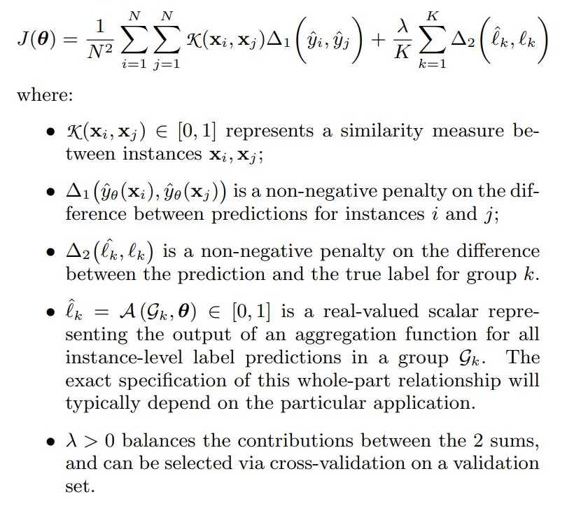
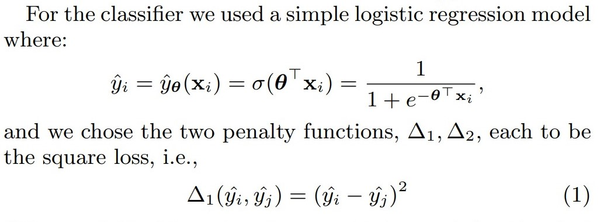
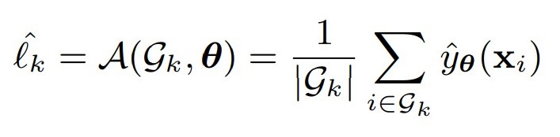
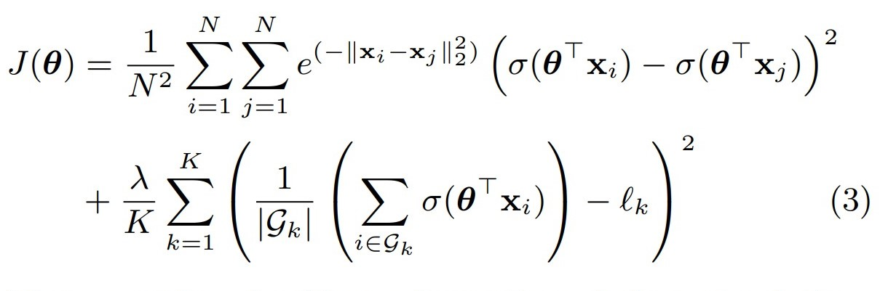

# COMP551_Mini4: Replication challenge 

- **Track 2:** Reproduce and modify the model. 
"You will first reproduce the results reported in the paper by running the code provided by the authors. Then you will try to modify the model and perform ablation studies to understand the model's robustness and evaluate the importance of the various model components. (In this context, the term "ablation" is used to describe the process of removing different model components to see how it impacts performance.) You can also try to improve the model based on your experiments. You should do a thorough analysis of the model through an
extensive set of experiments. Note that some experiments will be diffcult to replicate due to computational resources. It is fine to reproduce only a subset of the original paper's results or to work on a smaller variant of the data|if necessary. **At a minimum, in this track you should use the authors code to reproduce a non-trivial subset of their results and explore how the model performs after you make minor modiffcations (e.g., changes to hyperparameters). An outstanding project in this track would perform very a detailed ablation study and/or implement significant/meaningful extensions of the model.**. 
- **Our idea**: 
  - Hypertune the lambda hyperparameter 
  - Change the Kernel function 
  - Change the penalty functions  

## Our paper: 
- https://www.overleaf.com/7741963696nwdpsgxqvvqy

## Announcements: 
- Important notices about the project will be put in here. 
- Choose a group on MyCourses and join. 
- We will all be collaborating on this github repo. We will use branching **only if** we happen to be working on the very same thing. Otherwise, just please make sure not to mess with each other's work! :)  
 
## Tasks: 
- The tasks for each person will be put in here. These tasks will be decided in group. 
If there is something else wants to do additionally, please discuss it and then write it down here as well. 
- If a task is done, don't delete it immediately, instead, put a **done** mark next to it, and wait for two three days to delete it so we can keep track of what's done! 

### All 
- Read the paper in depth: http://dkotzias.com/papers/GICF.pdf 
- Read and familiarize with the code: https://github.com/dkloz/GICF
- Choose paper, fill the form https://forms.gle/vPiqmT27qM2U5SME7. 

### Jair: 
- See All 

### KhorenL:  
- See All 

### Rivka
- See All 

## Relevant Math of the Paper: 

### General Cost function  

### Prediction form: logistic regression 

 

### Group labels assignment 

### Specific Cost Function (i.e., this paper's) 

### Attribution 

This work is entirely based on the paper *From Group to Individual Labels using Deep Features* with its implementation code, produced by Dimitrios Kotzias, Misha Denil, Nando De Freitas, and Padhraic Smyth (see http://dkotzias.com/papers/GICF.pdf). The replication, modification and employment of the code is for academic purposes only. 

