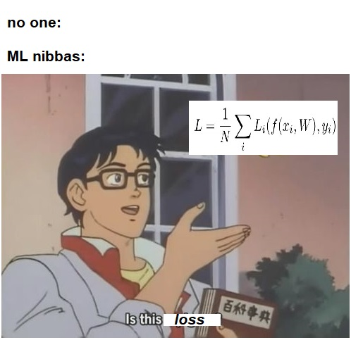

# COMP551_Mini4
Mini-project 4 : Replication challenge 

# Our paper: 
- https://www.overleaf.com/7741963696nwdpsgxqvvqy

# Announcements: 
- Important notices about the project will be put in here. 
- Choose a group on MyCourses and join. 
- We will all be collaborating on this github repo. We will use branching **only if** we happen to be working on the very same thing. Otherwise, just please make sure not to mess with each other's work! :)  
- If we have to train neural nets, we will be using Google Colab, so please make sure you have an account and familiarize with the environment. 
 
# Tasks: 
- The tasks for each person will be put in here. These tasks will be decided in group. 
If there is something else wants to do additionally, please discuss it and then write it down here as well. 
- If a task is done, don't delete it immediately, instead, put a **done** mark next to it, and wait for two three days to delete it so we can keep track of what's done! 

## All 
- Join the group on MyCourses 
- Please check out the repository structure and READMEs 
- Please check out the link to our overleaf paper. 

## Jair: 
- finish setting up repository and paper templates 

## KhorenL:  
- See All 

## Rivka
- See All 

# Reproducibility: 
- Instructions for reproduction will be indicated here later. 

# Best Model: 
- Best model description will be included in here: 

# Is this loss??? 

